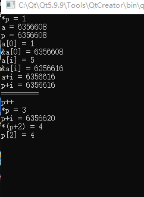

```C
#include <stdio.h>

int main()
{
    int *p,*q;//定义了两个指针
    int a[5] = {1,3,5,4,2};
    int b[3] = {7,5,8};//定义了两个数组
    int i=2;//定义一个变量,

    //各种表达式
    p =a;
    q = b;
     printf("*p = %d\n",*p);
     printf("a = %d\n",a);
     printf("p = %d\n",p);

     printf("a[0] = %d\n",a[0]);
     printf("p[0] = %d\n",p[0]);
     printf("&a[0] = %d\n",&a[0]);

      printf("=========\n");
      printf("=====add i: \n");
     printf("a[i] = %d\n",a[i]);
     printf("&a[i] = %d\n",&a[i]);
     printf("a+i = %d\n",a+i);
     printf("p+i = %d\n",p+i);

     printf("=========\n");
     p++;
     printf("=====p++;\n");
     printf("*p = %d\n",*p);
     printf("p+i = %d\n",p+i);
     printf("*(p+%d) = %d\n",i,*(p+i));
     printf("p[%d] = %d\n",i,p[i]);
//    a=b;//error
//    a++;//error

    return 0;
}
```



当数组名作为参数被传递到函数中，数组名自动退化为指针含义。